# Segmentation Project by Alex Cinatra Hutasoit

## Description
This program include 4 files that has it's own task : 
|  |  |
|--|--|
| `TrainingProperties.py` | to define the deep learning model and create the other requires properties such as function and class |
| `dataPreprocessing.py` | to clean the data |
| `train.py` or `train.ipynb` or `notebook.ipynb` | to train and build the model |
| `interface.py` | to present the result of the model prediction |

## Program Plan Development
| development process | status |
|--|--|
| create the model | 100% |
| data cleaning | 100% |
| train the model in colabs | maybe-ongoing  |
| interface for testing result | 100% |
[train-loss: 0.18, test-loss: 0.19]

## Process Result
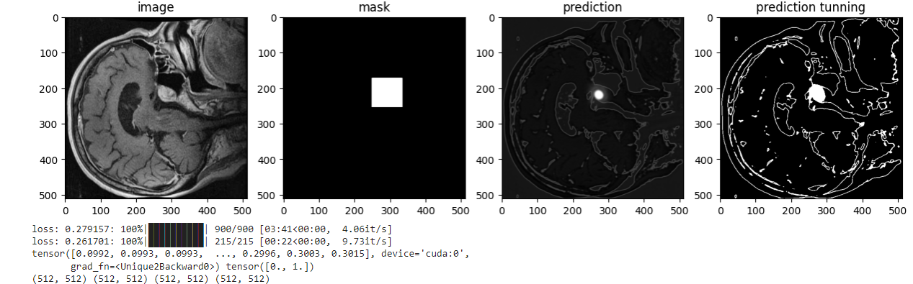

## How to use
**`dataPreprocessing.py`**
make sure that your `dest_data_path` and `src_data_path` is has the following structure:

    testingMigration = CreateAnotationLayers(
	    src_path="raw_data/test",
	    destination_path="data/test"    
    )
    testingMigration.createAnotation()
    
    trainingMigration = CreateAnotationLayers(
	    src_path="raw_data/train",
	    destination_path="data/train",
	    anot_key='id'
    )
    trainingMigration.createAnotation()

**`TrainingProperties.py`**

    train_root =  "data/train"
    test_root =  "data/test"
    
    trainSet = CustomDataset(train_root)
    testSet = CustomDataset(test_root)
    
    trainLoader = DataLoader(trainSet)
    testLoader = DataLoader(testSet)
    
    model = UNETModel()
    optim = torch.optim.Adam(model.parameters(), lr=0.005)
    criterion = torch.nn.BCEWithLogitsLoss()
    
    for epoch in  range(1):
	    train_error = []
	    test_error = []
	    
	    model, train_loss = trainOneEpoch(trainLoader, model, optim, criterion)
	    train_error.append(train_loss)
	    model, test_loss = testOneEpoch(testLoader, model, criterion)
	    test_error.append(test_loss)
	    
	    # here you can display your train and validation loss after 1 epoch using interface

**`interface.py`** 

    img, msk = testSet.__getitem__(idx)
    pred = model(img.unsqueeze(0).float().to(device))
    pred_tunning = (pred > 0.3) * 1
    
    interface(
        img=img,
        mask=mask,
        pred=pred_tunning
    )

## Final Result
| Model | Number Epoch | Desc |
|--|--|--|
| model1.pt | 12 | using tanh, not using dropout |
| model2.pt | 12 | using sigmoid, not using dropout |
| model3.pt | 12 | using sigmoid, using dropout |

**`the best result`** : model3.pt

The TrainLoss and TestLoss

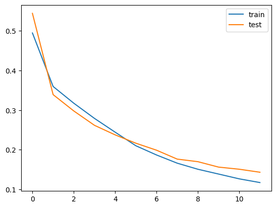

Randomly try to predict 10 Image

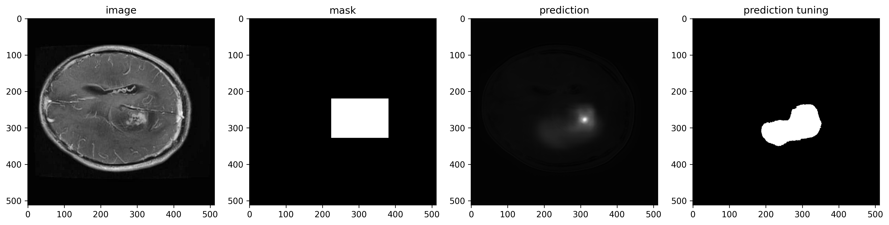

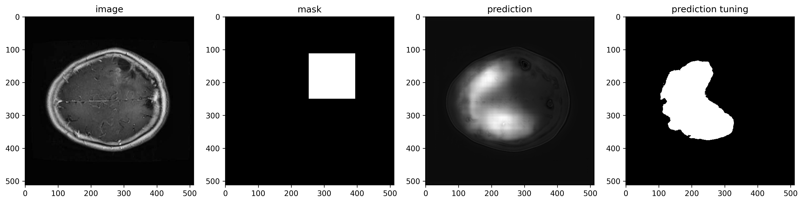

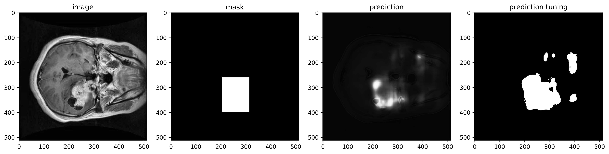

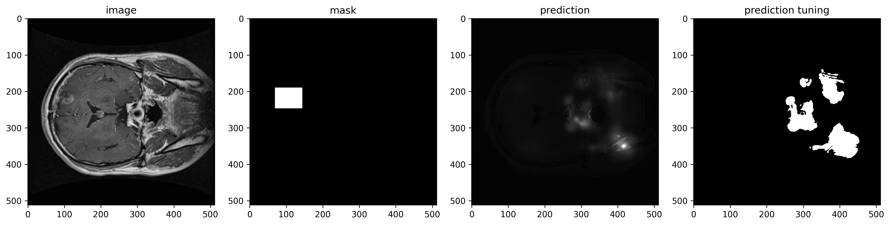

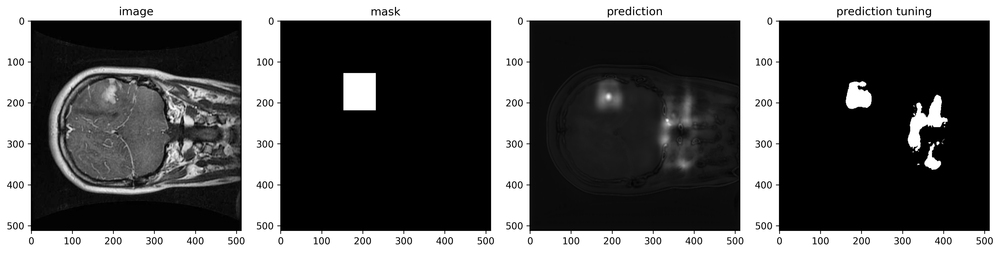

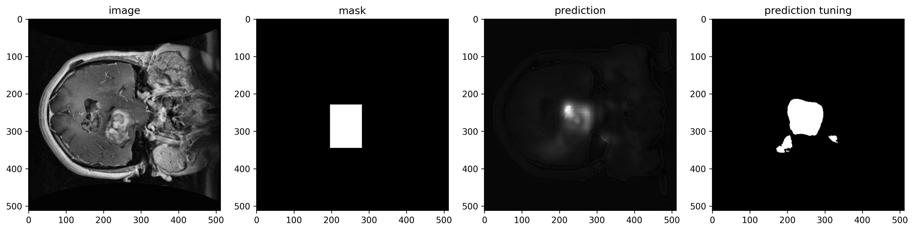

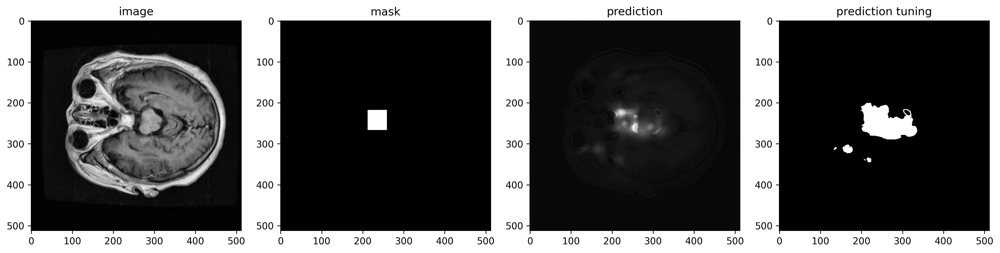

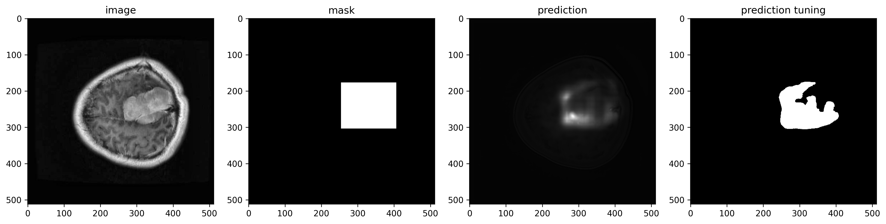

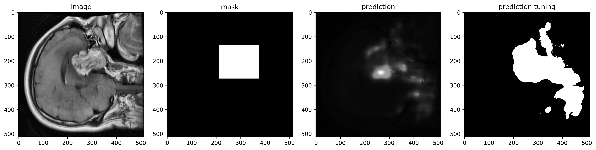

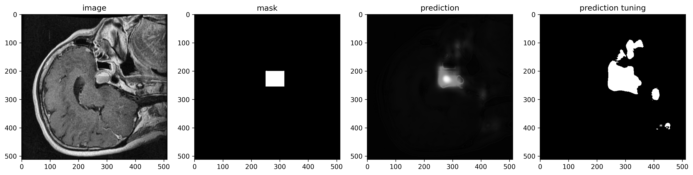

